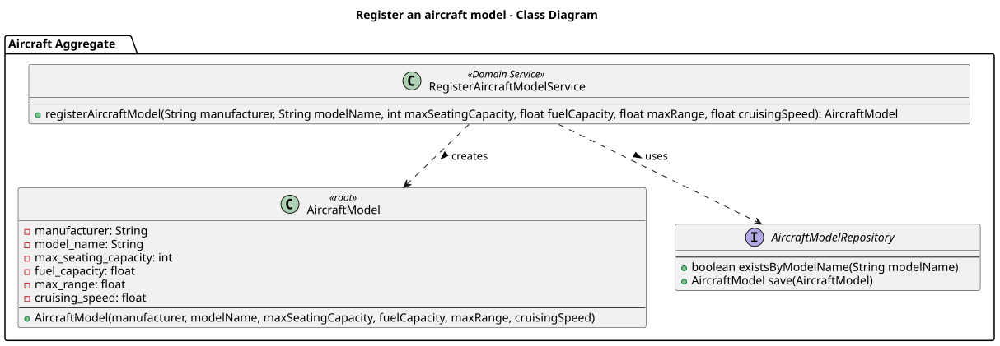
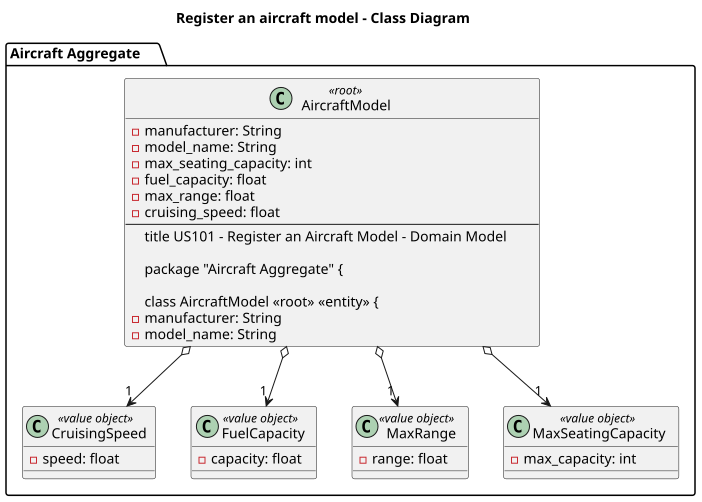
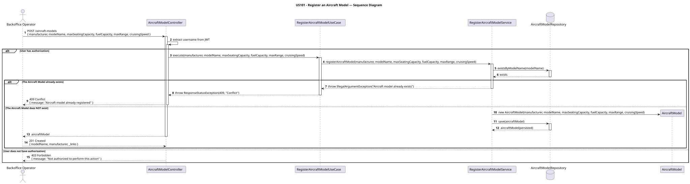

# US101 - Register an Aircraft Model

## User Story Description

_As a Backoffice Operator, I want to register an aircraft model with specifications including manufacturer, model name, seating capacity, fuel capacity, maximum range, and cruising speed._

## Customer Specifications and Clarifications

> -

## Class Diagram

## Domain Model

## Sequence Diagram

## OpenAPI Specification
The OpenAPI Specification is present in [US101.yaml](US101.yaml)