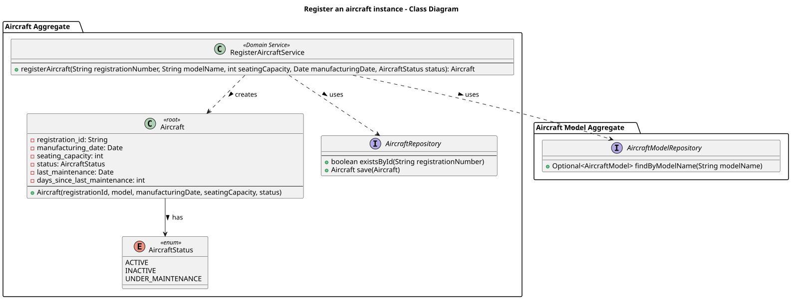

# US102 - Register a Specific Aircraft Instance

## User Story Description

_As an Air Transport Company Collaborator (ATCC), I want to register a specific aircraft instance with details such as registration number, model, manufacturing date, and current status (active, inactive, under maintenance)._

## Customer Specifications and Clarifications

> -

## Class Diagram

## Domain Model

## Sequence Diagram

## OpenAPI Specification
The OpenAPI Specification is present in [US102.yaml](US102.yaml)