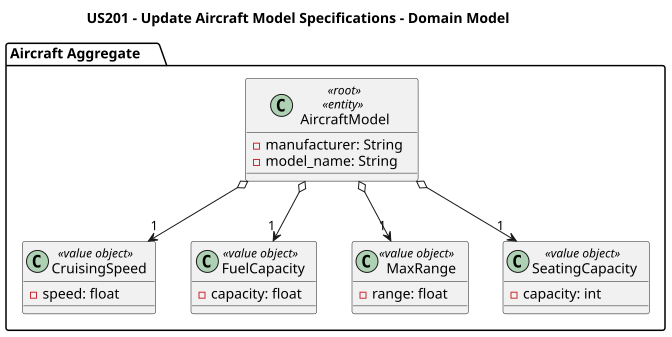
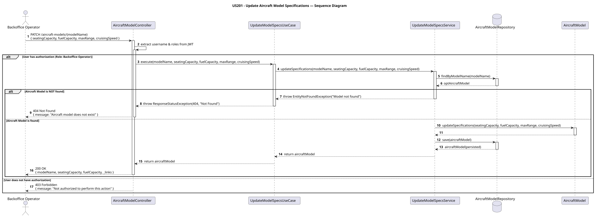

# US201 - Update Aircraft Model Specifications

## User Story Description

_As a Backoffice Operator, I want to update an aircraft model's specifications._

## Customer Specifications and Clarifications

> -

## Class Diagram

## Domain Model

## Sequence Diagram

## OpenAPI Specification
The OpenAPI Specification is present in [US201.yaml](US201.yaml)