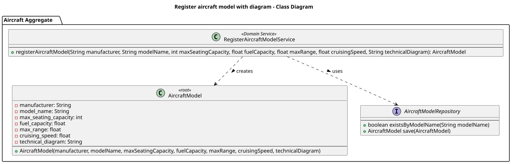
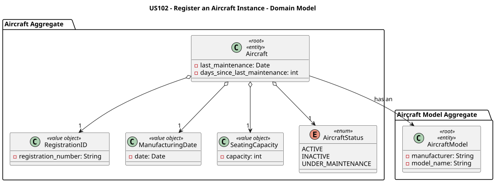
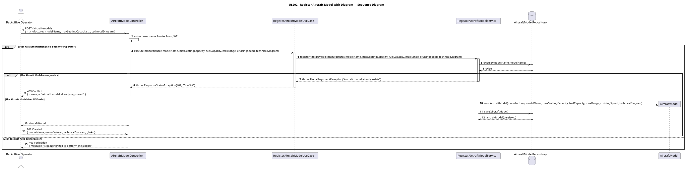

# US202 - Register an Aircraft Model with an Optional Image/Diagram

## User Story Description

_As a Backoffice Operator, I want to register an aircraft model with an optional image or technical diagram._

## Customer Specifications and Clarifications

> -

## Class Diagram

## Domain Model

## Sequence Diagram

## OpenAPI Specification
The OpenAPI Specification is present in [US202.yaml](US202.yaml)