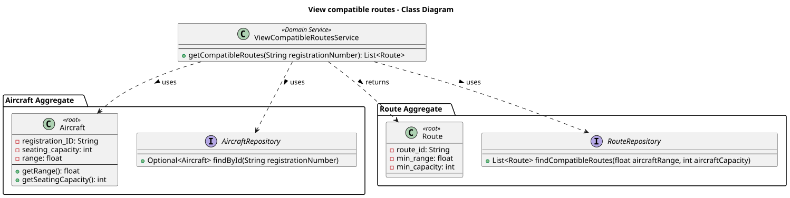
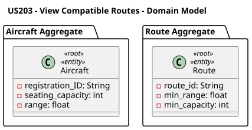
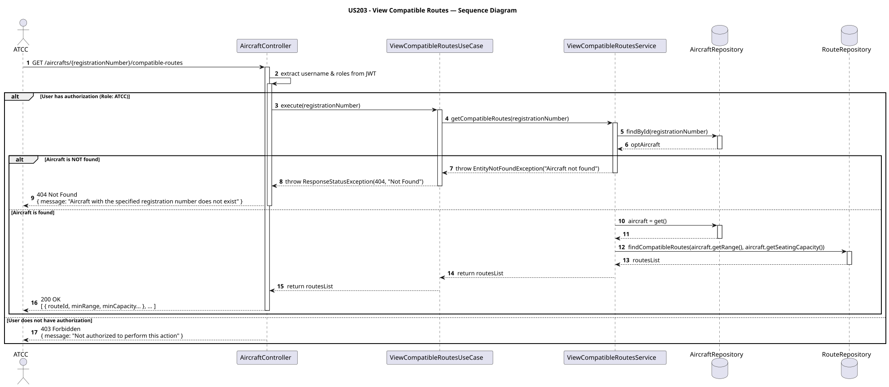

# US203 - View Compatible Routes for an Aircraft

## User Story Description

_As an ATCC, I want to view which routes are compatible with a specific aircraft based on its range and capacity. The same airplane model can have different seat configuration, and therefore different capacities._

## Customer Specifications and Clarifications

> -

## Class Diagram

## Domain Model

## Sequence Diagram

## OpenAPI Specification
The OpenAPI Specification is present in [US203.yaml](US203.yaml)