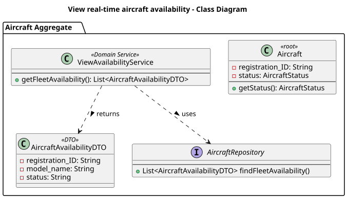
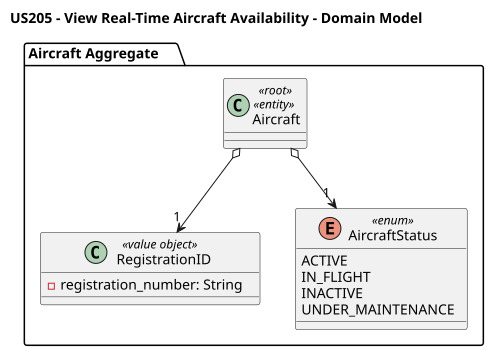
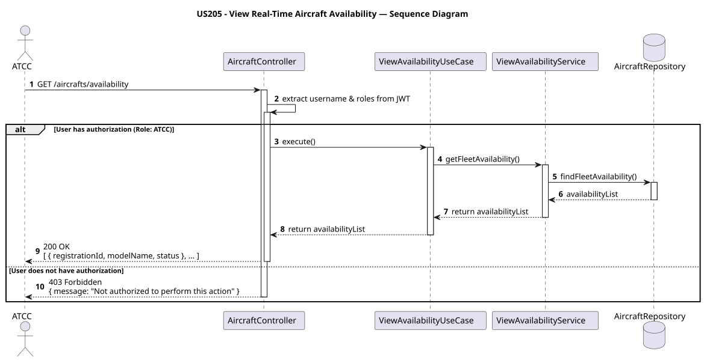

# US205 - View Real-Time Aircraft Availability

## User Story Description

_As an ATCC, I want to view real-time aircraft availability status (available, in-flight, under maintenance, inactive)._

## Customer Specifications and Clarifications

> -

## Class Diagram

## Domain Model

## Sequence Diagram

## OpenAPI Specification
The OpenAPI Specification is present in [US205.yaml](US205.yaml)