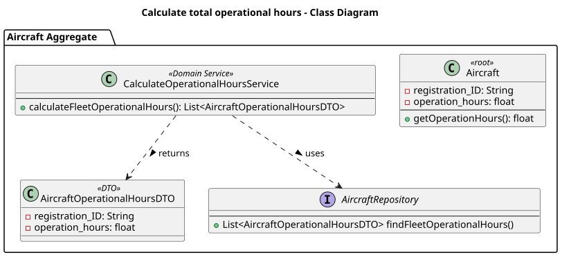
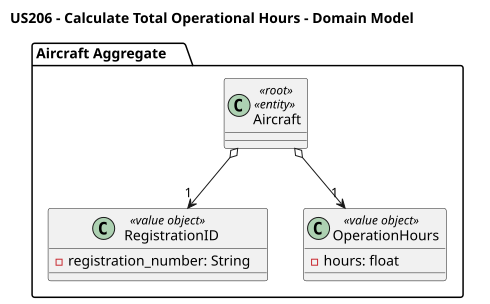
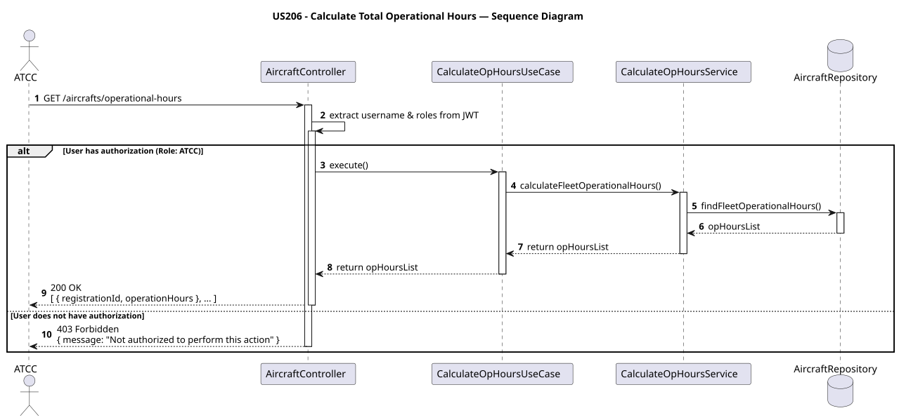

# US206 - Calculate Total Operational Hours

## User Story Description

_As an ATCC, I want to calculate the total operational hours for each aircraft in my fleet._

## Customer Specifications and Clarifications

> -

## Class Diagram

## Domain Model

## Sequence Diagram

## OpenAPI Specification
The OpenAPI Specification is present in [US206.yaml](US206.yaml)