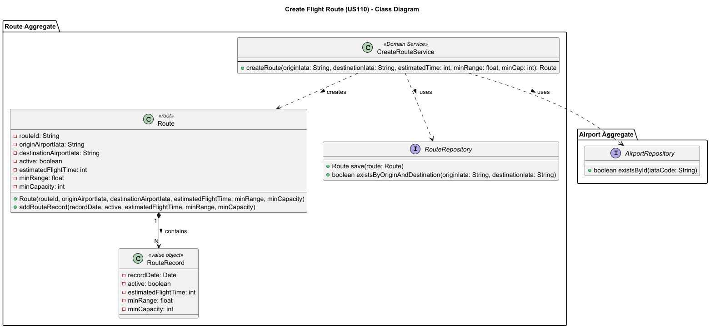
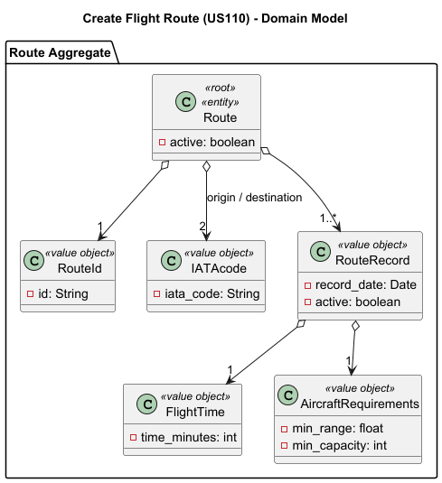
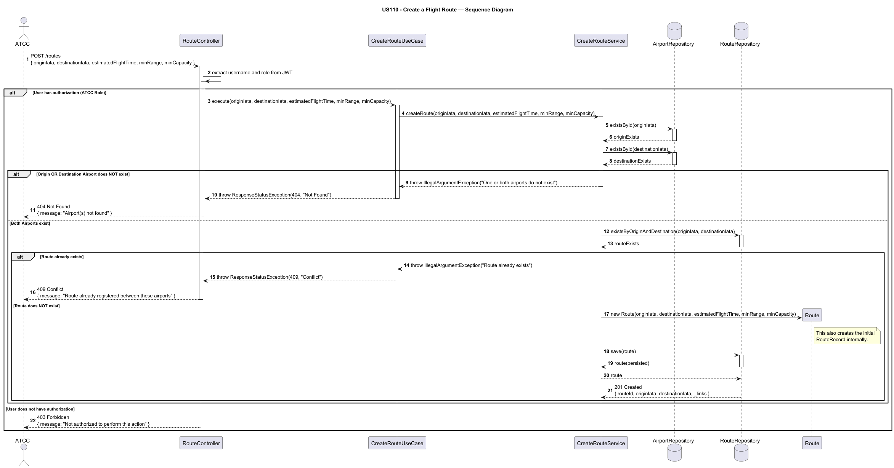

# US110 - Create FLight Route

## User Story Description

_ As an ATCC, I want to create a flight route by specifying origin airport, destination airport, estimated flight time,
and minimum aircraft requirements (range, capacity). The system should verify both airports exist._

## Customer Specifications and Clarifications

> -

## Class Diagram

## Domain Model

## Sequence Diagram

## OpenAPI Specification
The OpenAPI Specification is present in [US110.yaml](US110.yaml)