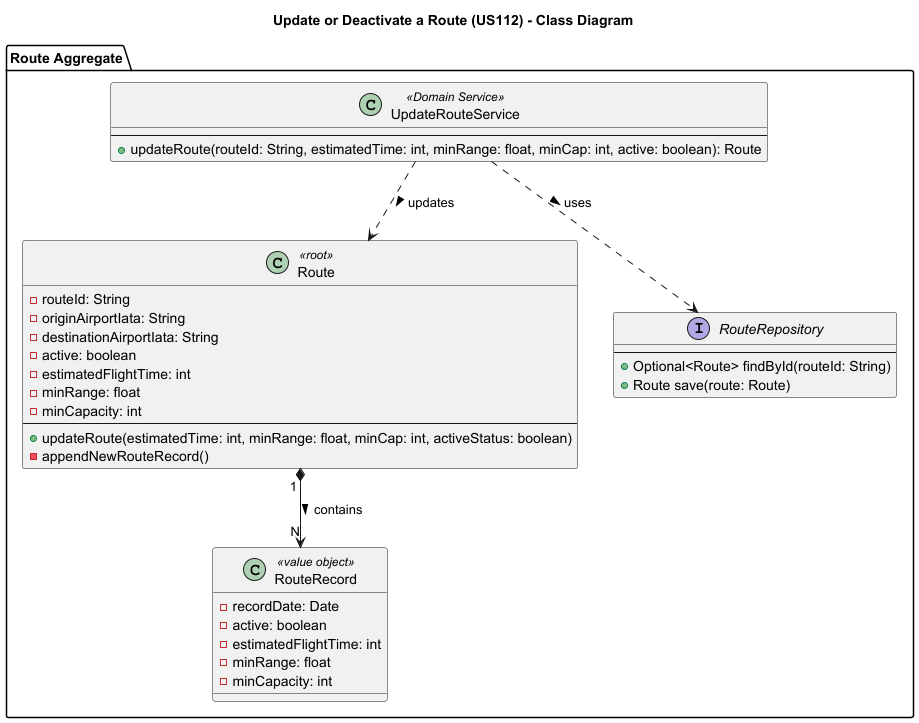
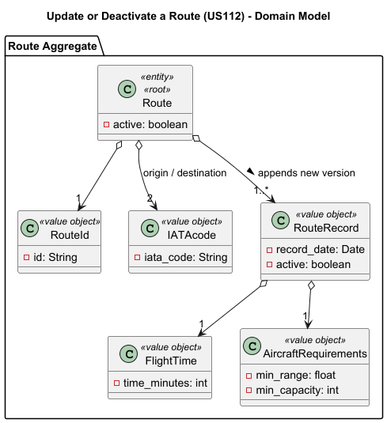
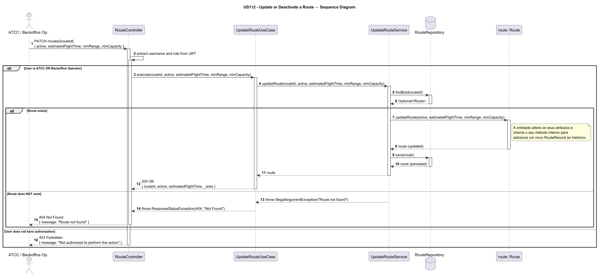

# US112 - Update or Deactive a Route

## User Story Description

_ As an ATCC or Backoffice Operator, I want to update or deactivate a route._

## Customer Specifications and Clarifications

> -

## Class Diagram

## Domain Model

## Sequence Diagram

## OpenAPI Specification
The OpenAPI Specification is present in [US112.yaml](US112.yaml)